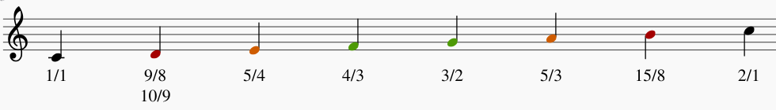

# Waarom sommige tonen goed samen klinken

Dit is een deel van de presentatie voor de Continuum tribe day.

## De grondtoon

De laagste frequentie waarmee een snaar kan trillen, de golflengte is het dubbel van de lengte van de snaar. Bij conventie is de la vastgelegd op 440Hz dus laten we met deze beginnen. In Supercollider start de server en speel een sinus van 440Hz:

```
s.boot; //boot server

{ SinOsc.ar(440, 0, 0.5) }.play; //play 440Hz sine wave, parameters are frequency, phase and amplitude multiplicator
```

Stop het afspelen door ctrl+. in te drukken.

Op een osciloscoop, in dit geval x42-scope, ziet dat er zo uit:


Ik heb de twee cursors gezet op het begin en einde van een volledige golf, onderaan kan je zien dat dit overeenkomt met 440Hz (de 0,4 is een meetfoutje door de resolutie waarop we werken).

Nu samen met deze noot willekeurige andere noten spelen klinkt waarschijnlijk niet aangenaam. Welke tonen gaan wel goed samen?

## Het oktaaf

De eerste boventoon of tweede harmonische is de noot waarvan de frequentie het dubbel is van de grondnoot. Er passen dus precies 2 golven in 1 golf van de grondnoot oftewel een verhouding van 2:1.

```
{ var grondtoon = 440;
	[ 
		SinOsc.ar(grondtoon, 0, 0.5),
		SinOsc.ar(grondtoon * 2, 0, 0.5)
	]
}.play; 
```


In het groen de grondtoon, in het rood het oktaaf en in het blauw de som van de twee. De som is ook het signaal dat naar de speakers gaat.

## Meer boventonen

Hetzelfde kunnen we doen voor andere verhoudingen. Als we een verhouding van 3:1 nemen krijgen we dit:


We zitten hier dus meer dan een oktaaf boven de grondtoon, om in hetzelfde oktaaf uit te komen delen we de frequentie door 2 om dezelfde noot een oktaaf te lager te krijgen. De verhouding wordt dus 3:2 en dit komt overeen met een reine kwint, of perfect fifth in het engels. Aangezien we op een la begonnen zijn geeft dit een mi, zouden we met do gestart zijn was dit een sol.

Laten we voor de lol deze output eens naar een tuner sturen om dit te bevestigen:


Inderdaad een hoge mi (E voor mi en 5 voor welk oktaaf op een pianoklavier). Je ziet op het display dat dit volgens de tuner niet exact een mi is, hierover later meer.

Deze serie zetten we gewoon verder: 4 keer de frequentie geeft weer een oktaaf, 5 keer geeft ons een grote terts. Op [Wikipedia - Harmonic series](https://en.wikipedia.org/wiki/Harmonic_series_(music)) vind je meer.

# De reine stemming

In wat we noemen de reine stemming leiden we de andere tonen af van enkele eenvoudige verhoudingen. Een kwint komt overeen met het verschil tussen de eerste boventoon (2/1) en de tweede boventoon (3/1) en krijgt daarom de breuk 3/2. Een reine kwart komt overeen met het verschil tussen de tweede boventoon (3/1) en de derde boventoon (4/1), en krijgt daarom de breuk 4/3. (Om het "verschil" te bekomen moet je hier delen, niet aftrekken.)



De twee mogelijke verhoudingen voor de secunde zijn het gevolg van ofwel het verschil te nemen tussen kwint en kwart (9/8), ofwel tussen kwart en kleine terts (10/9), voor wie hier meer over wil weten moet je maar eens wat bijlezen over het [didymische komma](https://nl.wikipedia.org/wiki/Didymisch_komma).

De tonen die het beste samenklinken zijn zoals gezegd het oktaaf, gevolgd door de reine kwint en de reine kwart (2:1, 3:2, 4:3). De sexten en tertsen, zowel groot als klein, klinken ook best nog goed maar de overige noten zijn dissonant.

# De gelijkzwevende stemming