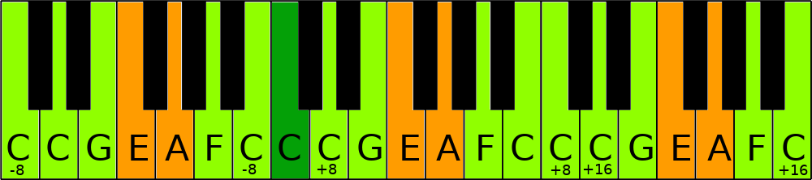

# Interface voor muziek

Na wat we in het vorige deel gezien hebben weten we welke tonen goed samengaan met een gegeven toon. Hier nog eens een overzichtje op een notenbalk:

Iedereen kent wel het pianoklavier:

Credit to: [Wikipedia](https://commons.wikimedia.org/wiki/File:Klaviatur-3-en.svg) 

Als we aanduiden welke noten samenklinken met de do (C):

Hier zien we dat de toetsen met de tonen die het slechts samenklinken met de do het dichts bij de do liggen. Qua interface design kan dit wel tellen. Dat is zoals aan de ene kant van een save-button een toets zetten om je file kapot te doen en aan de andere kant een verniel-harde-schijf toets. Een piano vraagt ook niet "U was in do-groot aan het spelen, weet u zeker dat u kei hard op de si wil rammen?" maar speelt gewoon.

Het kan nog leuker. Vroeger speelde ik klarinet, als ik die nu terug vastneem weet ik begot niet meer hoe ik de noten moet spelen. Gelukkig zijn de grepen simpel. Not.

Meerdere grepen voor dezelfde toon? Kan handig zijn, dan pak je degene die het makkelijkst te pakken is afhankelijk van de vorige of volgende noot. Verschillende grepen voor la-kruis en si-mol? Verwarrend! Geen wonder dat het zo lang duurt voor je een instrument kan spelen. Heb je dat eindelijk onder de knie en je speelt een do dan klinkt er een si-mol want een klarinet staat in een andere stemming.

Moesten we zo'n designstreken uithalen met onze software het kot zou te klein zijn. Daarom stel ik volgend alternatief voor:

Hier is het onmogelijk om "vals" te spelen door per ongeluk een verkeerde toets in te drukken. Meer nog, zelfs als je per ongeluk (of express, je doet maar) 2 toetsen tegelijk aanslaat klinkt het nog altijd goed.

Beetje Python om dit mogelijk te maken: [note mapper](noteMapper.py)